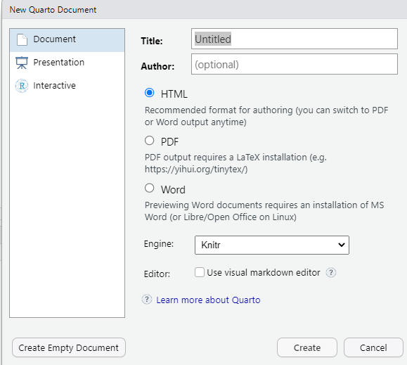

```{r}
#| label: setup-episode
#| include: false
source("data/download_data.R")
```

::::::::::::::::::::::::::::::::::::::: objectives

- Create a .qmd document containing R code, text, and plots
- Create a YAML header to control output
- Understand basic syntax of Quarto and Markdown
- Customise code chunks to control formatting
- Use code chunks and in-line code to create dynamic, reproducible documents

::::::::::::::::::::::::::::::::::::::::::::::::::

:::::::::::::::::::::::::::::::::::::::: questions

- What is Quarto?
- How can I integrate my R code with text and plots?
- How can I convert .qmd files to .html?

::::::::::::::::::::::::::::::::::::::::::::::::::

## Creating a Quarto file

To create a new Quarto document in RStudio, click File -> New File ->
Quarto Document:

{alt="Screenshot of the New Quarto file dialogue box in RStudio"}

Then click on 'Create Empty Document'. Normally you could enter the title of
your document, your name (Author), and select the type of output, but we will be
learning how to start from a blank document.

## Basic components of Quarto

To control the output, a YAML (YAML Ain't Markup Language) header is needed:

```
---
title: "My Awesome Report"
author: "Emmet Brickowski"
date: ""
format: html
---
```

The header is defined by the three hyphens at the beginning (`---`) and the
three hyphens at the end (`---`).

Although not recommended, you can leave the YAML out. Then the output will be 
by default a HTML file. It's still better to include the file format in the YAML 
header by adding the line `format: html`. You can also adapt the `format` of
the file, to `pdf` or `docx`. We will start with an HTML document and discuss the other
options later.

You can add more information about your document in the YAML header such as `title`, `date` and `author`. This information will be displayed at the top of your document.  There are many more fields that can be added to the YAML header that provide additional information about the document or define the behaviour of the file. But we won't discuss them now. 

After the header, to begin the body of the document, you start typing after the end of the YAML
header (i.e. after the second `---`).

## Markdown syntax

Markdown is a popular markup language that allows you to add formatting elements
to text, such as **bold**, *italics*, and `code`. The formatting will not be
immediately visible in a markdown (.md) document, like you would see in a Word
document. Rather, you add Markdown syntax to the text, which can then be
converted to various other files that can translate the Markdown syntax.
Markdown is useful because it is lightweight, flexible, and platform
independent.

Some platforms provide a real time preview of the formatting, like RStudio's
visual markdown editor (available from version 1.4).

First, let's create a heading! A `#` in front of text indicates to Markdown that
this text is a heading. Adding more `#`s make the heading smaller, i.e. one `#` is
a first level heading, two `##`s is a second level heading, etc. up to the 6th level heading.

```
# Title
## Section
### Sub-section
#### Sub-sub section
##### Sub-sub-sub section
###### Sub-sub-sub-sub section
```

(only use a level if the one above is also in use)

Since we have already defined our title in the YAML header, we will use a
section heading to create an Introduction section.


```
## Introduction
```

You can make things **bold** by surrounding the word with double asterisks,
`**bold**`, or double underscores, `__bold__`; and *italicize* using single
asterisks, `*italics*`, or single underscores, `_italics_`.

You can also combine **bold** and *italics* to write something ***really***
important with triple-asterisks, `***really***`, or underscores, `___really___`;
and, if you're feeling bold (pun intended), you can also use a combination of
asterisks and underscores, `**_really_**`, `**_really_**`.

To create `code-type` font, surround the word with backticks,
``` `code type` ```.

Now that we've learned a couple of things, it might be useful to implement them:

```
## Introduction

This report uses the **tidyverse** package along with the *SAFI* dataset, 
which has columns that include:
```

Then we can create a list for the variables using `-`, `+`, or `*` keys.

```
## Introduction

This report uses the **tidyverse** package along with the *SAFI* dataset, 
which has columns that include:

- village
- interview_date
- no_members
- years_liv
- respondent_wall_type
- rooms
```

You can also create an ordered list using numbers:

```
1. village
2. interview_date
3. no_members
4. years_liv
5. respondent_wall_type
6. rooms
```

And nested items by tab-indenting:

```
- village
  + Name of village
- interview_date
  + Date of interview
- no_members
  + How many family members lived in a house
- years_liv
  + How many years respondent has lived in village or neighbouring village
- respondent_wall_type
  + Type of wall of house
- rooms
  + Number of rooms in house
```

For more Markdown syntax see [the following reference guide](https://quarto.org/docs/authoring/markdown-basics.html).

Now we can render the document into HTML by clicking the **Render** button in the
top of the Source pane (top left), or use the keyboard shortcut
<kbd>Ctrl</kbd>\+<kbd>Shift</kbd>\+<kbd>K</kbd> on Windows and Linux, and
<kbd>Cmd</kbd>\+<kbd>Shift</kbd>\+<kbd>K</kbd> on Mac. If you haven't saved the
document yet, you will be prompted to do so when you **Render** for the first
time.

{alt="The 'rendering' process: First, Quarto file is converted to Markdown, which is then converted (via pandoc) to .html, .pdf, .docx, etc."}

## Writing a Quarto report

Now we will add some R code from our previous data wrangling and visualisation,
which means we need to make sure **tidyverse** is loaded. It is not enough to
load **tidyverse** from the console, we will need to load it within our Quarto
document. The same applies to our data. To load these, we will need to create a
'code chunk' at the top of our document (below the YAML header).

A code chunk can be inserted by clicking Code > Insert Chunk, or by using the
keyboard shortcuts <kbd>Ctrl</kbd>\+<kbd>Alt</kbd>\+<kbd>I</kbd> on Windows and Linux,
and <kbd>Cmd</kbd>\+<kbd>Option</kbd>\+<kbd>I</kbd> on Mac.

The syntax of a code chunk is:

```{r}
#| echo: fenced
#| label: chunk-name

# Here is where you place the R code that you want to run.
```

A Quarto document knows that this text is not part of the report from the
```` ``` ```` that begins and ends the chunk. It also knows that the code
inside of the chunk is R code from the `r` inside of the curly braces (`{}`).
Below the curly braces, you can add code chunk options after the `#|` sign. In this way, you can for example add a label for the code chunk. Naming a chunk is optional, but recommended. Each chunk label must be unique, and only contain alphanumeric characters and `-`.

```{r}
#| echo: false
#| label: package-data
#| message: false
#| purl: false

library(tidyverse)
interviews <- read_csv("data/SAFI_clean.csv", na = "NULL")
```

To load **tidyverse** and our `SAFI_clean.csv` file, we will insert a chunk and
call it 'setup'. Since we don't want this code or the output to show in our
rendered HTML document, we add an `#| include: false` option after the curly braces.

```{r}
#| label: setup
#| include: false
#| echo: fenced

library(tidyverse)
library(here)
interviews <- read_csv(here("data/SAFI_clean.csv"), na = "NULL")
```


:::::::::::::::::::::::::::::::::::::::::  callout

## Important Note!

The file paths you give in a .qmd document, e.g. to load a .csv file, are
relative to the .qmd document, **not** the project root.

As suggested in the Starting with Data episode, we highly recommend the use of
the `here()` function to keep the file paths consistent within your project.

::::::::::::::::::::::::::::::::::::::::::::::::::

## Insert table

Next, we will re-create a table from the Data Wrangling episode which
shows the average household size grouped by `village` and `memb_assoc`.
We can do this by creating a new code chunk and calling it 'interview-tbl'.
Or, you can come up with something more creative (just remember to stick to the
naming rules).

It isn't necessary to **Render** your document every time you want to see the
output. Instead you can run the code chunk with the green triangle in the top
right corner of the the chunk, or with the keyboard shortcuts:
<kbd>Ctrl</kbd>\+<kbd>Alt</kbd>\+<kbd>C</kbd> on Windows and Linux, or
<kbd>Cmd</kbd>\+<kbd>Option</kbd>\+<kbd>C</kbd> on Mac.

To make sure the table is formatted nicely in our output document, we will need
to use the `kable()` function from the **knitr** package. The `kable()` function
takes the output of your R code and renders it into a nice looking HTML table. You
can also specify different aspects of the table, e.g. the column names, a
caption, etc.

Run the code chunk to make sure you get the desired output.

```{r}
#| purl: false
interviews %>%
    filter(!is.na(memb_assoc)) %>%
    group_by(village, memb_assoc) %>%
    summarize(mean_no_membrs = mean(no_membrs)) %>%
  knitr::kable(col.names = c("Village", "Member Association", 
                             "Mean Number of Members"))
```

When you are generating a table in quarto the label should be prefixed with `tbl-`,
e.g. `tbl-interviews`.
You can add a caption to the chunk options with `tbl-cap: "Your caption here"`.

```{r purl=FALSE}
#| label: tbl-interviews
#| tbl-cap: "A useful description about the table."
#| eval: false
#| echo: true
interviews %>%
    filter(!is.na(memb_assoc)) %>%
    group_by(village, memb_assoc) %>%
    summarize(mean_no_membrs = mean(no_membrs)) %>%
  knitr::kable(col.names = c("Village", "Member Association", 
                             "Mean Number of Members"))
```

```{r}
#| label: tbl-interview-out
#| echo: false
interviews %>%
    filter(!is.na(memb_assoc)) %>%
    group_by(village, memb_assoc) %>%
    summarize(mean_no_membrs = mean(no_membrs)) %>%
  knitr::kable(col.names = c("Village", "Member Association", 
                             "Mean Number of Members"),
               caption = "A useful description about the table.")
```

## Customising chunk output

We mentioned using `include: false` in a code chunk to prevent the code and
output from printing in the rendered document. There are additional options
available to customise how the code-chunks are presented in the output document.
The options are entered in the code chunk using the 'hash pipe', `#|`.

| Option | Options | Output                                                                                                    | 
| ------ | ------- | --------------------------------------------------------------------------------------------------------- |
| `eval`       | `TRUE` or `FALSE`    | Whether or not the code within the code chunk should be run.                                              | 
| `echo`       | `TRUE` or `FALSE`    | Choose if you want to show your code chunk in the output document. `echo = TRUE` will show the code chunk.                                       | 
| `include`       | `TRUE` or `FALSE`    | Choose if the output of a code chunk should be included in the document. `FALSE` means that your code will run, but will not show up in the document.                                 | 
| `warning`       | `TRUE` or `FALSE`    | Whether or not you want your output document to display potential warning messages produced by your code. | 
| `message`       | `TRUE` or `FALSE`    | Whether or not you want your output document to display potential messages produced by your code.         | 
| `fig-align`       | `default`, `left`, `right`, `center`      | Where the figure from your R code chunk should be output on the page                                      | 

:::::::::::::::::::::::::::::::::::::::::  callout

## Tip

- The default settings for the above chunk options are all `true`.
- The default settings can be modified per chunk, or with
  `knitr::opts_chunk$set()`,
- Entering `knitr::opts_chunk$set(echo = FALSE)` will change the default of
  value of `echo` to `FALSE` for **every** code chunk in the document.

The defaults can also be changed in the YAML header with:

```
---
knitr:
  opts_chunk:
    echo: false
---
```

::::::::::::::::::::::::::::::::::::::::::::::::::

:::::::::::::::::::::::::::::::::::::::  challenge

## Exercise

Play around with the different options in the chunk with the code for the
table, and re-**Render** to see what each option does to the output.

What happens if you use `eval: false` and `echo: false`? What is the
difference between this and `include: false`?

:::::::::::::::  solution

## Solution to Exercise

Create a chunk with `eval: false, echo: false`, then create another
chunk with `include: false` to compare.
`eval: false` and `echo: false` will neither run the code in the chunk,
nor show the code in the rendered document. The code chunk essentially
doesn't exist in the rendered document as it was never run. Whereas
`include: false` will run the code and store the output for later use.

:::::::::::::::::::::::::

::::::::::::::::::::::::::::::::::::::::::::::::::

## In-line R code

Now we will use some in-line R code to present some descriptive statistics.
To use in-line R-code, we use the same backticks that we used in the Markdown
section, with an `r` to specify that we are generating R-code. The difference
between in-line code and a code chunk is the number of backticks. In-line R code
uses one backtick (`r`), whereas code chunks use three backticks
(``` r ```).

For example, today's date is ``` ``r "r Sys.Date()"`` ```, will be rendered as:
today's date is `r Sys.Date()`.  
The code will display today's date in the output document (well, technically the
date the document was last rendered).

The best way to use in-line R code, is to minimise the amount of code you need
to produce the in-line output by preparing the output in code chunks. Let's say
we're interested in presenting the average household size in a village.

```{r}
#| label: in-line-code
#| purl: false
# create a summary data frame with the mean household size by village
mean_household <- interviews %>%
    group_by(village) %>%
    summarize(mean_no_membrs = mean(no_membrs))

# and select the village we want to use
mean_chirodzo <- mean_household %>%
  filter(village == "Chirodzo")
```

Now we can make an informative statement on the means of each village, and include
the mean values as in-line R-code. For example:

The average household size in the village of Chirodzo is
``` ``r "r round(mean_chirodzo$mean_no_membrs, 2)"`` ```

becomes...

The average household size in the village of Chirodzo is
`r round(mean_chirodzo$mean_no_membrs, 2)`.

Because we are using in-line R code instead of the actual values, we have created
a dynamic document that will automatically update if we make changes to the dataset
and/or code chunks.

## Plots

Finally, we will also include a plot, so our document is a little more colourful
and a little less boring. We will use the `interview_plotting` data from the
previous episode.

If you were unable to complete the previous lesson or did not save the data,
then you can create it in a new code chunk.

```{r}
#| label: interview-plotting-data
#| eval: true
#| purl: false
## Not run, but can be used to load in data from previous lesson!
interviews_plotting <- interviews %>%
  ## pivot wider by items_owned
  separate_rows(items_owned, sep = ";") %>%
  ## if there were no items listed, changing NA to no_listed_items
  replace_na(list(items_owned = "no_listed_items")) %>%
  mutate(items_owned_logical = TRUE) %>%
  pivot_wider(names_from = items_owned, 
              values_from = items_owned_logical, 
              values_fill = list(items_owned_logical = FALSE)) %>%
  ## pivot wider by months_lack_food
  separate_rows(months_lack_food, sep = ";") %>%
  mutate(months_lack_food_logical = TRUE) %>%
  pivot_wider(names_from = months_lack_food, 
              values_from = months_lack_food_logical, 
              values_fill = list(months_lack_food_logical = FALSE)) %>%
  ## add some summary columns
  mutate(number_months_lack_food = rowSums(select(., Jan:May))) %>%
  mutate(number_items = rowSums(select(., bicycle:car)))
```

Plots created in Quarto should have a label prefixed with `fig-`, e.g.
`#| label: fig-fancy-plot`.

:::::::::::::::::::::::::::::::::::::::  challenge

## Exercise

Create a new code chunk for the plot, and copy the code from any of the plots
we created in the previous episode to produce a plot in the chunk. I recommend
one of the colourful plots.

If you are feeling adventurous, you can also create a new plot with the
`interviews_plotting` data frame.

:::::::::::::::  solution

## Solution to Exercise

```{r}
#| label: fig-fancy-plot
#| answer: true
#| purl: false
interviews_plotting %>%
  ggplot(aes(x = respondent_wall_type)) +
  geom_bar(aes(fill = village))
```

:::::::::::::::::::::::::

::::::::::::::::::::::::::::::::::::::::::::::::::

We can also create a caption with the chunk option `fig-cap: "Caption here"`,
and add some nicer labels using the `labs()` function.

```{r}
#| label: fig-chunk-name
#| fig-cap: "I made this plot while attending an awesome Data Carpentries workshop where I learned a ton of cool stuff!"
#| echo: true
#| eval: false

interviews_plotting %>%
  ggplot(aes(x = respondent_wall_type)) +
  geom_bar(aes(fill = village), position = "dodge") + 
  labs(x = "Type of Wall in Home", y = "Count", fill = "Village Name") +
  scale_fill_viridis_d() # add colour deficient friendly palette
```

...or, ideally, something more informative.

```{r}
#| label: fig-captioned-plot
#| fig-cap: "I made this plot while attending an awesome Data Carpentries workshop where I learned a ton of cool stuff!"
#| echo: false
#| eval: true

interviews_plotting %>%
  ggplot(aes(x = respondent_wall_type)) +
  geom_bar(aes(fill = village), position = "dodge") + 
  labs(x = "Type of Wall in Home", y = "Count", fill = "Village Name") +
  scale_fill_viridis_d() # add colour deficient friendly palette
```

Now, you may have been wondering why I insisted that you prefix the labels of
your tables in figures, but there is a useful reason for this! It allows you to
cross-reference them in the text of your document, and it requires that the
label is unique, and that they have the correct prefix.

For example, we can talk about the table we made earlier and reference it using
the label `@tbl-interview`, which, when rendered, becomes Table 1.

We can do the same with our figures. For example, `@fig-fancy-plot` becomes
Figure 1. The number will of course depend on whether any plots or figures comes
before it, but since you just need to reference the label, there's no need to
know what number a specific plot has in a document (especially useful for
figure-heavy documents).
