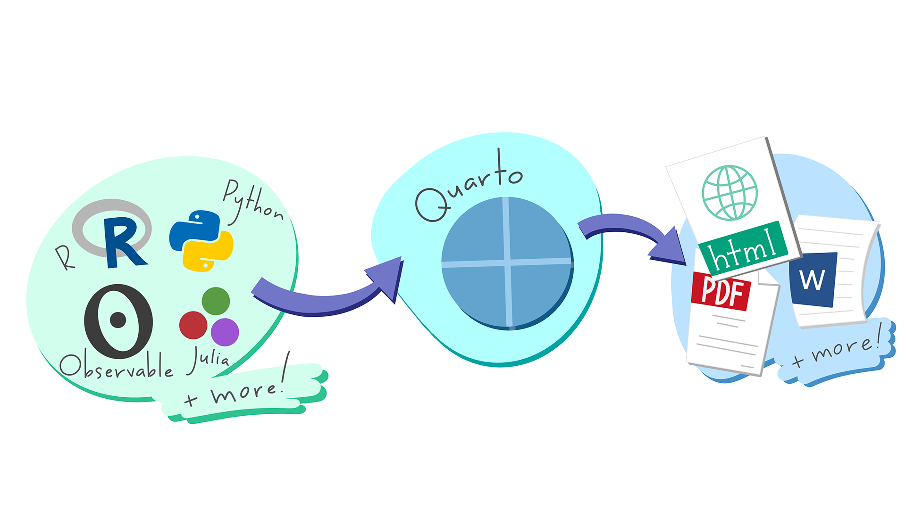

::: objectives
-   Create a .qmd document containing R code, text, and plots
-   Create a YAML header to control output
-   Understand basic syntax of Quarto and Markdown
-   Customise code chunks to control formatting
-   Use code chunks and in-line code to create dynamic, reproducible
    documents
:::

::: questions
-   What is Quarto?
-   How can I integrate my R code with text and plots?
-   How can I convert .qmd files to .html?
:::

## Quarto

Quarto is a flexible type of document that allows you to seamlessly
combine executable R code, and its output, with text in a single
document. These documents can be readily converted to multiple static
and dynamic output formats, including PDF (.pdf), Word (.docx), and HTML
(.html).

The benefit of a well-prepared Quarto document is full reproducibility.
This also means that, if you notice a data transcription error, or you
are able to add more data to your analysis, you will be able to
recompile the report without making any changes in the actual document.

Quarto comes pre-installed with RStudio (as of v2022.07), so no action
is necessary.

<figure>


::: {.cell}
::: {.cell-output-display}
{fig-alt='A schematic representing the multi-language input (e.g. Python, R, Observable, Julia) and multi-format output (e.g. PDF, HTML, Word documents, and more) versatility of Quarto.' width=100%}
:::
:::


<figcaption>A schematic representing the multi-language input (e.g. Python, R, Observable, Julia) and multi-format output (e.g. PDF, HTML, Word documents, and more) versatility of Quarto. Image source: [Posit](https://rstudio.github.io/cheatsheets/html/quarto.html)</figcaption>

</figure>

## Other output options

You can convert Quarto to a PDF or a Word document (among others). Put
`pdf` or `word` in the initial header of the file to indicate the
desired output format.

```         
---
title: "My Awesome Report"
author: "Emmet Brickowski"
date: ""
output: word
---
```

::: callout
## Note: Creating PDF documents

Creating .pdf documents may require installation of some extra software.
The R package `tinytex` provides some tools to help make this process
easier for R users. With `tinytex` installed, run
`tinytex::install_tinytex()` to install the required software (you'll
only need to do this once) and then when you render to pdf `tinytex`
will automatically detect and install any additional LaTeX packages that
are needed to produce the pdf document. Visit the [tinytex
website](https://yihui.org/tinytex/) for more information.
:::

::: callout
## Note: Inserting citations into a Quarto file

It is possible to insert citations into a Quarto file using the editor
toolbar. The editor toolbar includes commonly seen formatting buttons
generally seen in text editors (e.g., bold and italic buttons). The
toolbar is accessible by using the settings dropdown menu (next to the
'Render' dropdown menu) to select 'Use Visual Editor', also accessible
through the shortcut 'Crtl+Shift+F4'. From here, clicking 'Insert'
allows 'Citation' to be selected (shortcut: 'Crtl+Shift+F8'). For
example, searching '10.1007/978-3-319-24277-4' in 'From DOI' and
inserting will provide the citation for `ggplot2` [@wickham2016]. This
will also save the citation(s) in 'references.bib' in the current
working directory. 

Visit the [R Studio
website](https://rstudio.github.io/visual-markdown-editing/) for more
information. Tip: obtaining citation information from relevant packages
can be done by using `citation("package")`.
:::

## Resources

-   [Markdown tutorial](https://commonmark.org/help/tutorial/)
-   [Official Quarto website](https://quarto.org/) (comprehensive resource of tutorials and documentation)
-   [Welcome to Quarto](https://www.youtube.com/watch?v=yvi5uXQMvu4&ab_channel=PositPBC) - workshop by Posit (former RStudio)
-   [R Markdown: The Definitive Guide](https://bookdown.org/yihui/rmarkdown/) - book by the RStudio team on R Markdown, the predecessor of Quarto

::: keypoints
-   R Markdown is a useful language for creating reproducible documents
    combining text and executable R code.
-   Specify chunk options to control formatting of the output document
:::
