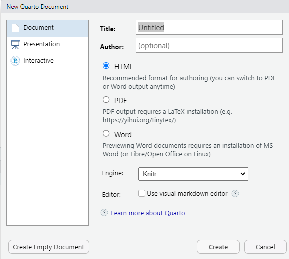

::::::::::::::::::::::::::::::::::::::: objectives

- Create a .qmd document containing R code, text, and plots
- Create a YAML header to control output
- Understand basic syntax of Quarto and Markdown
- Customise code chunks to control formatting
- Use code chunks and in-line code to create dynamic, reproducible documents

::::::::::::::::::::::::::::::::::::::::::::::::::

:::::::::::::::::::::::::::::::::::::::: questions

- What is Quarto?
- How can I integrate my R code with text and plots?
- How can I convert .qmd files to .html?

::::::::::::::::::::::::::::::::::::::::::::::::::

## Creating a Quarto file

To create a new Quarto document in RStudio, click File -> New File ->
Quarto Document:

{alt="Screenshot of the New Quarto file dialogue box in RStudio"}

Then click on 'Create Empty Document'. Normally you could enter the title of
your document, your name (Author), and select the type of output, but we will be
learning how to start from a blank document.

## Basic components of Quarto

To control the output, a YAML (YAML Ain't Markup Language) header is needed:

```
---
title: "My Awesome Report"
author: "Emmet Brickowski"
date: ""
format: html
---
```

The header is defined by the three hyphens at the beginning (`---`) and the
three hyphens at the end (`---`).

Although not recommended, you can leave the YAML out. Then the output will be 
by default a HTML file. It's still better to include the file format in the YAML 
header by adding the line `format: html`. You can also adapt the `format` of
the file, to `pdf` or `docx`. We will start with an HTML document and discuss the other
options later.

You can add some additional information about your document in the YAML header such as `title`, `date` and `author`. This information will be displayed at the top of your document.  There are many more fields that can be added to the YAML header that provide additional information about the document or define the behaviour of the file. But we won't discuss them now. 

After the header, to begin the body of the document, you start typing after the end of the YAML
header (i.e. after the second `---`).

## Markdown syntax

Markdown is a popular markup language that allows you to add formatting elements
to text, such as **bold**, *italics*, and `code`. The formatting will not be
immediately visible in a markdown (.md) document, like you would see in a Word
document. Rather, you add Markdown syntax to the text, which can then be
converted to various other files that can translate the Markdown syntax.
Markdown is useful because it is lightweight, flexible, and platform
independent.

Some platforms provide a real time preview of the formatting, like RStudio's
visual markdown editor (available from version 1.4).

First, let's create a heading! A `#` in front of text indicates to Markdown that
this text is a heading. Adding more `#`s make the heading smaller, i.e. one `#` is
a first level heading, two `##`s is a second level heading, etc. up to the 6th level heading.

```
# Title
## Section
### Sub-section
#### Sub-sub section
##### Sub-sub-sub section
###### Sub-sub-sub-sub section
```

(only use a level if the one above is also in use)

Since we have already defined our title in the YAML header, we will use a
section heading to create an Introduction section.


```
## Introduction
```

You can make things **bold** by surrounding the word with double asterisks,
`**bold**`, or double underscores, `__bold__`; and *italicize* using single
asterisks, `*italics*`, or single underscores, `_italics_`.

You can also combine **bold** and *italics* to write something ***really***
important with triple-asterisks, `***really***`, or underscores, `___really___`;
and, if you're feeling bold (pun intended), you can also use a combination of
asterisks and underscores, `**_really_**`, `**_really_**`.

To create `code-type` font, surround the word with backticks,
``` `code type` ```.

Now that we've learned a couple of things, it might be useful to implement them:

```
## Introduction

This report uses the **tidyverse** package along with the *SAFI* dataset, 
which has columns that include:
```

Then we can create a list for the variables using `-`, `+`, or `*` keys.

```
## Introduction

This report uses the **tidyverse** package along with the *SAFI* dataset, 
which has columns that include:

- village
- interview_date
- no_members
- years_liv
- respondent_wall_type
- rooms
```

You can also create an ordered list using numbers:

```
1. village
2. interview_date
3. no_members
4. years_liv
5. respondent_wall_type
6. rooms
```

And nested items by tab-indenting:

```
- village
  + Name of village
- interview_date
  + Date of interview
- no_members
  + How many family members lived in a house
- years_liv
  + How many years respondent has lived in village or neighbouring village
- respondent_wall_type
  + Type of wall of house
- rooms
  + Number of rooms in house
```

For more Markdown syntax see [the following reference guide](https://www.markdownguide.org/basic-syntax).

Now we can render the document into HTML by clicking the **Render** button in the
top of the Source pane (top left), or use the keyboard shortcut
<kbd>Ctrl</kbd>\+<kbd>Shift</kbd>\+<kbd>K</kbd> on Windows and Linux, and
<kbd>Cmd</kbd>\+<kbd>Shift</kbd>\+<kbd>K</kbd> on Mac. If you haven't saved the
document yet, you will be prompted to do so when you **Render** for the first
time.

{alt="The 'knitting' process: First, R Markdown is converted to Markdown, which is then converted (via pandoc) to .html, .pdf, .docx, etc."}
